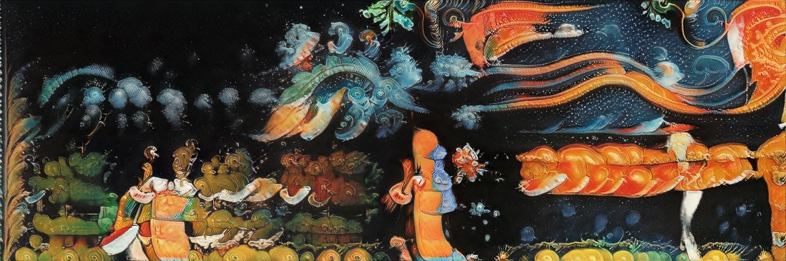

# StyleGAN2 for practice

<p align='center'></p>

This version of famous [StyleGAN2] is intended mostly for fellow artists, who rarely look at scientific metrics, but rather need a working creative tool. At least, this is what I use daily myself. 
Tested on Tensorflow 1.14, requires `pyturbojpeg` for JPG support. For more explicit details refer to the original implementations. 

Note about [StyleGAN2-ada]: Performed tests have shown yet smoother (not faster!) convergence, but lower output variety. Moreover, ada-version has failed on few-shot datasets (50~100 images); so meanwhile i personally stick to this repo with Diff Augmentation.

## Features
* inference (image generation) in arbitrary resolution (may cause artifacts!)
* **multi-latent inference** with split-frame or masked blending
* non-square aspect ratio support (picked from dataset; resolution must be divisible by 2**n, such as 512x256, 1280x768, etc.)
* transparency (alpha channel) support (picked from dataset)
* models mixing (SWA) and layers-blending (from [Justin Pinkney])
* freezing lower D layers for better finetuning (from [Freeze the Discriminator])

Windows batch-commands for main tasks, such as ::
* video rendering with slerp/cubic/gauss trajectory smoothing (requires [FFMPEG])
* animated "playback" of saved latent snapshots, direction vectors
* easy models surgery, etc.

also, from [Data-Efficient GANs] ::
* differential augmentation for fast training on small datasets (~100 images)
* support of custom CUDA-compiled TF ops and (slower) Python-based reference ops

also, from [Aydao] ::
* funky "digression" technique (added inside the network for ~6x speed-up)
* cropping square models to non-square aspect ratio (experimental)

also, from [Peter Baylies] and [skyflynil] ::
* non-progressive configs (E,F) with single-scale datasets
* raw JPG support in TFRecords dataset (dramatic savings in disk space & dataset creation time)
* conditional support (labels)
* vertical mirroring augmentation

## Training

* Put your files in `data` as subfolder. If needed, crop square fragments from `source` video or directory with images (feasible method, if you work with patterns or shapes, rather than compostions):
```
 multicrop.bat source 512 256 
```
This will cut every source image (or video frame) into 512x512px fragments, overlapped with 256px shift by X and Y. Result will be in directory `source-sub`, rename it as you wish. Non-square dataset should be prepared separately.

* Make compact TFRecords dataset from directory with JPG images `data/mydata`:
```
 prepare_dataset.bat mydata
```
This will create file `mydata-512x512.tfr` in `data` directory (if your dataset resolution is 512x512). For images with alpha channel remove `--jpg` option from this bat-file, and also `--jpg_data` option from `train.bat` or `train_resume.bat` files. For conditional model split the data by subfolders (`mydata/1`, `mydata/2`, ..) and add `--labels` option.

* Train StyleGAN2 on prepared dataset:
```
 train.bat mydata
```
This will run training process, according to the options in `src/train.py`. If there's no TFRecords file from the previous step, it will be created at this point. The training results (models and samples) are saved under the `train` directory, similar to original Nvidia approach. Only newest configs E and F are used in this repo (default is F; set `--config E` if you face OOM issue). 

Please note: we save both compact models (containing only Gs network for inference) as `<dataset>-...pkl` (e.g. `mydata-512-0360.pkl`), and full models (containing G/D/Gs networks for further training) as `snapshot-...pkl`. The naming is for convenience only, it does not affect the operations anymore (as the arguments are stored inside the models).

For small datasets (100x images instead of 10000x) one should add `--d_aug` option to use [Differential Augmentation] for more effective training. 
The length of the training is defined by `--lod_step_kimg XX` argument. It's kind of legacy from [progressive GAN] and defines one step of progressive training. The network with base resolution 1024px will be trained for 20 such steps, for 512px - 18 steps, et cetera. Reasonable `lod_step_kimg` value for big datasets is 300-600, while in `--d_aug` mode 20-40 is sufficient.

* Resume training on `mydata` dataset from the last saved model at `train/000-mydata-512-f` directory:
```
 train_resume.bat mydata 000-mydata-512-f
```

* Uptrain (finetune) trained model on new data:
```
 train_resume.bat newdata 000-mydata-512-f --finetune
```
There's no need to go for exact steps in this case, you may stop when you're ok with the results (it's better to set low `lod_step_kimg` to follow the progress). Again, `--d_aug` would greatly enhance training here. There's also `--freezeD` option, supposedly enhancing finetuning on similar data.

## Generation

* Generate smooth looped animation to test the model:
```
 gen.bat ffhq-1024.pkl
```

* Generate custom smooth looped animation between random latent points:
```
 gen.bat ffhq-1024 1280-720 500-20
```
This will load `ffhq-1024.pkl` from `model` directory and make a 1280x720 px video of 500 frames, with interpolation step of 20 frames between keypoints. Please note: omitting `.pkl` extension would load custom network, effectively enabling arbitrary resolution, multi-latent blending, etc. Using filename with extension will load the network from PKL "as is" (useful to test foreign downloaded models). There are `--cubic` and `--gauss` options for animation smoothing, and few `--scale_type` choices. Add `--save_lat` option to save all traversed dlatent points as Numpy array in `*.npy` file (useful for further curating).

* Generate more various imagery:
```
 gen.bat ffhq-1024 3072-1024 500-20 -n 3-1
```
This will produce animated composition of 3 independent frames, blended together horizontally (like the image in the repo header). Argument `--splitfine X` controls boundary fineness (0 = smoothest). 
Instead of simple frame splitting, one can load external mask(s) from b/w image file (or folder with file sequence):
```
 gen.bat ffhq-1024 3072-1024 500-20 --latmask <path>
```
Arguments `--digress X` would add some animated funky displacements with X strength. Arguments `--trunc X` controls truncation psi parameter, as usual. 

**NB**: Windows batch-files support only 9 command arguments; if you need more options, you have to edit batch-file itself.

* Project external images onto StyleGAN2 model dlatent space:
```
 project.bat ffhq-1024.pkl <imagedir>
```
The result (found dlatent points as Numpy arrays in `*.npy` files, and video/still previews) will be saved to `_out/proj` directory. 

* Generate smooth animation between saved dlatent points:
```
 play_dlatents.bat ffhq-1024 mynpy 50 1920-1080
```
This will load saved dlatent points from `_in/mynpy` and produce a smooth looped animation between them (with resolution 1920x1080 and interpolation step of 50 frames). `mynpy` may be a file or a directory with `*.npy` files. To select only few frames from a sequence `somename.npy`, create text file with comma-delimited frame numbers and save it as `somename.txt` in the same directory (check examples for FFHQ model). You can also "style" the result: setting `--style_npy_file blonde458.npy` will load dlatent from `blonde458.npy` and apply it to higher layers, producing some visual similarity. `--cubic` smoothing and `--digress X` displacements are also applicable here. 

* Generate animation from saved dlatent point and feature directions (say, aging/smiling/etc for faces model):
```
 play_vectors.bat ffhq-1024.pkl blonde458.npy vectors_ffhq
```
This will load base dlatent point from `_in/blonde458.npy` and move it along latent direction vectors from `_in/vectors_ffhq`, one by one. Result is saved as looped video. 

## Tweaking models

* Strip G/D networks from a full model, leaving only Gs for inference:
```
 model_convert.bat snapshot-1024.pkl 
```
The resulting file is saved with `-Gs` suffix. It's recommended to add `-r` option to reconstruct the network, saving necessary arguments with it. Useful for foreign downloaded models.

* Add or remove layers (from a trained model) to adjust its resolution for further finetuning:
```
 model_convert.bat snapshot-256.pkl --res 512
```
This will produce new model with 512px resolution, populating weights on the layers up to 256px from the source snapshot (the rest will be initialized randomly). It also can decrease resolution (say, make 512 from 1024). Note that this effectively changes the number of layers in the model. 
This option works with complete (G/D/Gs) models only, since it's purposed for transfer-learning (the resulting model will contain either partially random weights, or wrong `ToRGB` params). 

* Crop resolution of a trained model:
```
 model_convert.bat snapshot-1024-xxx.pkl --res 1024-768
```
This will produce working non-square 1024x768 model. Opposite to the method above, this one doesn't change layer count. This is experimental feature (as stated by the author @Aydao), also using some voluntary logic, so works only with basic resolutions.

* Combine lower layers from one model with higher layers from another:
```
 models_blend.bat model1.pkl model1.pkl <res> <level>
```
`<res>` is resolution, at which the models are switched (usually 32/64/128); `<level>` is 0 or 1.

* Mix few models by stochastic averaging all weights:
```
 models_mix.bat models_dir
```
This would work properly only for models from one "family", i.e. uptrained (finetuned) from the same original model. 


[StyleGAN2]: <https://github.com/NVlabs/stylegan2>
[StyleGAN2-ada]: <https://github.com/NVlabs/stylegan2-ada>
[Peter Baylies]: <https://github.com/pbaylies/stylegan2>
[Aydao]: <https://github.com/aydao/stylegan2-surgery>
[Justin Pinkney]: <https://github.com/justinpinkney/stylegan2/blob/master/blend_models.py>
[skyflynil]: <https://github.com/skyflynil/stylegan2>
[Data-Efficient GANs]: <https://github.com/mit-han-lab/data-efficient-gans>
[Differential Augmentation]: <https://github.com/mit-han-lab/data-efficient-gans>
[Freeze the Discriminator]: <https://arxiv.org/abs/2002.10964>
[FFMPEG]: <https://ffmpeg.org/download.html>
[progressive GAN]: <https://github.com/tkarras/progressive_growing_of_gans>
